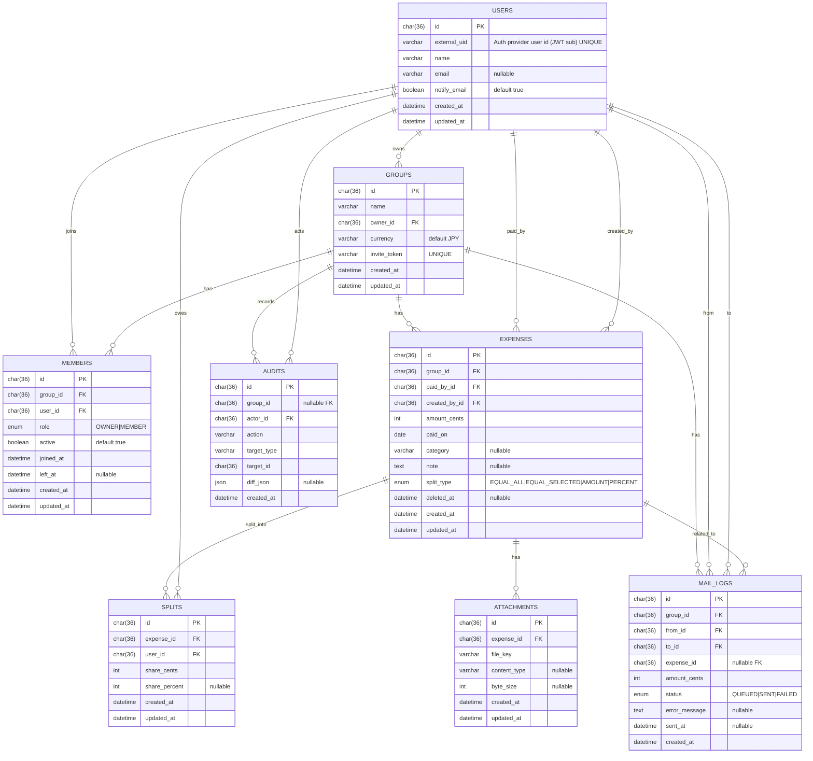

# ER Diagram（Mermaid）- Splitto（説明付き / MySQL）

このドキュメントは、割り勘・立替精算アプリ **Splitto** のデータモデルを
ER図（Mermaid）とテーブル説明（Markdown）をセットで管理します。

## 共通方針（MySQL）
- DB：MySQL 8.x 想定
- 金額：`*_cents`（整数）で保持（JPYでも整数で統一）
- タイムゾーン：DBはUTC、表示はJST
- 途中参加/途中退出：`members.active` + `left_at` で表現
  - `active=1`：在籍中（`left_at` は NULL）
  - `active=0`：退出済み（`left_at` は NOT NULL）
- 削除：原則論理削除（`deleted_at`）
- 監査ログ：重要操作は必ず残す
- 認証方式：JWT 前提。ただしこのドキュメントでは認証用カラムを無理に追加しない（YAGNI）
  - 認証まわりの追加カラムは「認証のIssue」で必要になったタイミングで追加する

---

## Mermaid ER Diagram

## テーブル説明（重要 / MySQL）

### USERS（ユーザー）
**目的**：認証ユーザーのプロフィールと通知設定を保持する（認証詳細は別Issueで追加する）。

**主なカラム**
- `external_uid`：認証基盤のユーザー識別子（JWT の `sub` など、UNIQUE）
- `name`：表示名
- `email`：メール連絡機能で使用（任意）
- `notify_email`：メール連絡を受け取るか（任意。将来の通知ON/OFFの基礎）

**制約・ルール**
- `external_uid` は必ずユニーク
- メール送信は `email` が存在するユーザーのみ可能（認証・検証の要否は別Issueで決める）

**インデックス案**
- `users(external_uid)` UNIQUE
- `users(email)`（必要なら UNIQUE。MVPでは運用判断）

---

### GROUPS（グループ）
**目的**：旅行・飲み会・同棲など、精算対象となる単位。

**主なカラム**
- `owner_id`：グループ作成者（OWNER）
- `invite_token`：招待リンク用トークン（UNIQUE）
- `currency`：通貨（将来拡張用、MVPでは JPY 固定）

**制約・ルール**
- グループ作成時に OWNER を必ず `members` に登録する（role=OWNER, active=true）
- `invite_token` は外部公開されるため、推測困難なランダム値を使用する

**インデックス案**
- `groups(owner_id)`
- `groups(invite_token)` UNIQUE

---

### MEMBERS（メンバー / 中間テーブル）
**目的**：グループ所属（多対多）・ロール管理・途中参加/途中退出を表現する。

MySQL では `left_at IS NULL` を条件にした部分ユニーク制約が弱いため、
**`active` フラグを追加**し、
「在籍中は必ず 1 レコードのみ」を DB で担保する。

**主なカラム**
- `role`：`OWNER | MEMBER`
- `active`：在籍中フラグ（在籍中 `true` / 退出済み `false`）
- `joined_at`：参加日時
- `left_at`：退出日時（在籍中は NULL）

**制約・ルール**
- 在籍中メンバーは `active = true` のレコードを 1 件のみ持つ
- 退出処理は `active = false` と `left_at` を同一トランザクションで更新
- 再参加時は `active = true` の新規レコードを作成する

**インデックス案**
- `members(group_id, user_id, active)` UNIQUE（重要）
- `members(group_id, active)`（在籍中メンバー取得用）

---

### EXPENSES（支払い）
**目的**：立替支払いの元データ。清算・集計の基点となる。

**主なカラム**
- `paid_by_id`：実際に支払ったユーザー
- `created_by_id`：入力したユーザー（代理入力を想定）
- `amount_cents`：支払金額（整数）
- `paid_on`：支払日（date）
- `split_type`：割り方の種類
- `deleted_at`：論理削除用

**制約・ルール**
- `amount_cents > 0`
- 削除は物理削除せず、論理削除とする
- 清算の根拠は `splits` に保存された確定値を使用する（清算提案はDBに持たない）

**インデックス案**
- `expenses(group_id, paid_on)`
- `expenses(group_id, deleted_at)`
- `expenses(paid_by_id)`

---

### SPLITS（支払い割り当て）
**目的**：各ユーザーの負担額を確定保存する（清算の根拠）。

**主なカラム**
- `share_cents`：ユーザーごとの負担金額（整数）
- `share_percent`：割合指定時のみ使用（任意）

**制約・ルール**
- 1 つの支払いに対して、対象メンバー分のレコードを作成する
- `SUM(share_cents) = expenses.amount_cents` を必ず保証する（サーバー側で確定）
- `share_cents >= 0`
- 同一支払い内で同一ユーザーの重複割当は禁止する（`expense_id, user_id` UNIQUE）

**インデックス案**
- `splits(expense_id)`
- `splits(expense_id, user_id)` UNIQUE

---

### ATTACHMENTS（添付ファイル）
**目的**：レシート画像などの添付ファイルのメタ情報を管理する。

**主なカラム**
- `file_key`：ストレージ（S3 等）上のキー
- `content_type`：MIME タイプ
- `byte_size`：ファイルサイズ

**制約・ルール**
- ファイルの実体はストレージに保存する
- DB にはメタ情報のみを保持する
- 署名付き URL は都度生成し、DBには保存しない

**インデックス案**
- `attachments(expense_id)`

---

### AUDITS（監査ログ）
**目的**：重要操作の履歴を保持し、トレーサビリティを確保する。

**主なカラム**
- `actor_id`：操作したユーザー
- `action`：操作内容（例：`expense.created`）
- `target_type` / `target_id`：操作対象
- `diff_json`：変更差分（任意）

**制約・ルール**
- 支払い・メンバー・設定変更など重要操作は必ず記録する
- 削除操作も必ずログに残す

**インデックス案**
- `audits(group_id, created_at)`
- `audits(actor_id, created_at)`
- `audits(target_type, target_id)`

---

### MAIL_LOGS（メール送信履歴）
**目的**：清算金額連絡メールの送信履歴と状態管理を行う。

**主なカラム**
- `from_id`：送信操作を行ったユーザー
- `to_id`：送信先ユーザー
- `expense_id`：特定支払いに紐づく場合のみ使用（任意）
- `amount_cents`：送信した金額
- `status`：`QUEUED | SENT | FAILED`
- `error_message`：失敗理由（任意）

**制約・ルール**
- メール未登録ユーザーには送信不可（UI でも対象外とする）
- 送信前に必ず確認画面を表示する
- 失敗時は再送可能とする

**インデックス案**
- `mail_logs(group_id, created_at)`
- `mail_logs(to_id, created_at)`
- `mail_logs(status, created_at)`

---

## MySQL向け実装メモ（重要）

- UUID は初期実装では可読性・実装安全性を優先し `CHAR(36)` を使用する。
  以下の条件が明確になったタイミングで `BINARY(16)` への移行を検討する：
  - テーブル行数が数百万件規模に増加した
  - UUID を含む JOIN / INDEX がボトルネックになった
  - `EXPLAIN` の結果からインデックスサイズや比較コストが問題になった
  - パフォーマンス改善が事業要件として求められるようになった
  それまでは過度な最適化を避け、保守性・デバッグ性を優先する。

- `members` テーブルでは「在籍中メンバーは 1 件のみ」という制約を
  MySQL でも確実に担保するため `active` フラグを使用する。
  - `(group_id, user_id, active)` に UNIQUE 制約を張る
  - 退出時は `active = false` と `left_at` を同一トランザクションで更新する

- `splits` の合計金額が `expenses.amount_cents` と一致することは
  DB 制約ではなく、アプリケーション側のトランザクション処理で保証する。
  - 支払い登録時に割当を確定させ、以降は不整合を起こさない設計とする
