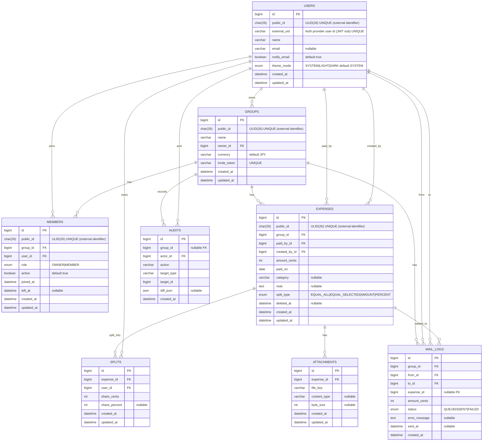

# ER Diagram（Mermaid）- Splitto（説明付き / MySQL）

このドキュメントは、割り勘・立替精算アプリ **Splitto** のデータモデルを
ER図（Mermaid）とテーブル説明（Markdown）をセットで管理します。

## 共通方針（MySQL）
- DB：MySQL 8.x 想定
- 金額：`*_cents`（整数）で保持（JPYでも整数で統一）
- タイムゾーン：DBはUTC、表示はJST
- 途中参加/途中退出：`members.active` + `left_at` で表現
  - `active=1`：在籍中（`left_at` は NULL）
  - `active=0`：退出済み（`left_at` は NOT NULL）
- 削除：原則論理削除（`deleted_at`）
- 監査ログ：重要操作は必ず残す
- 認証方式：JWT 前提。ただしこのドキュメントでは認証用カラムを無理に追加しない（YAGNI）
  - 認証まわりの追加カラムは「認証のIssue」で必要になったタイミングで追加する

---

## Mermaid ER Diagram

## テーブル説明（重要 / MySQL）

### USERS（ユーザー）
**目的**：認証ユーザーのプロフィールと通知・UI設定を保持する
（認証の詳細ロジックは別Issueで追加する）。

**主なカラム**
- `id`：内部用主キー（BIGINT, PK）
- `public_id`：外部公開用ユーザー識別子（ULID, UNIQUE）
- `external_uid`：認証基盤のユーザー識別子（JWT の `sub` など、UNIQUE）
- `name`：表示名
- `email`：メール連絡機能で使用（任意）
- `notify_email`：メール連絡を受け取るか（任意。将来の通知ON/OFFの基礎）
- `theme_mode`：UIテーマ設定（ダークモード切替）
  - `SYSTEM | LIGHT | DARK`（デフォルト `SYSTEM`）

**制約・ルール**
- `id` は内部処理・JOIN専用とし、外部公開しない
- `public_id` は URL / API 等の外部公開識別子として使用する
- `external_uid` は必ずユニーク（Clerk 等の認証基盤と 1:1 対応）
- メール送信は `email` が存在するユーザーのみ可能
- 退会（論理削除）については要件確定後に `deleted_at` を追加する（YAGNI）

**インデックス案**
- `users(public_id)` UNIQUE
- `users(external_uid)` UNIQUE
- `users(email)`（必要なら UNIQUE。MVPでは運用判断）

---

### GROUPS（グループ）
**目的**：旅行・飲み会・同棲など、精算対象となる単位。

**主なカラム**
- `id`：内部用主キー（BIGINT, PK）
- `public_id`：外部公開用グループ識別子（ULID, UNIQUE）
- `owner_id`：グループ作成者（USERS.id）
- `invite_token`：招待リンク用トークン（UNIQUE）
- `currency`：通貨（将来拡張用、MVPでは JPY 固定）

**制約・ルール**
- URL / API でグループを特定する際は `public_id` を使用する
- `owner_id` は内部的な参照用（BIGINT）
- グループ作成時に OWNER を必ず `members` に登録する（role=OWNER, active=true）
- `invite_token` は外部公開されるため、推測困難なランダム値を使用する

**インデックス案**
- `groups(public_id)` UNIQUE
- `groups(owner_id)`
- `groups(invite_token)` UNIQUE

---

### MEMBERS（メンバー / 中間テーブル）
**目的**：グループ所属（多対多）・ロール管理・途中参加/途中退出を表現する。

MySQL では `left_at IS NULL` を条件にした部分ユニーク制約が弱いため、
`active` フラグを追加し、途中参加 / 途中退出を表現する。

MVPでは **履歴を保持しない** 方針とし、
`(group_id, user_id)` を **常に 1 レコード** に集約して運用する。

**主なカラム**
- `id`：内部用主キー（BIGINT, PK）
- public_id：外部公開用メンバー識別子（ULID, UNIQUE）
- `group_id`：GROUPS.id
- `user_id`：USERS.id
- `role`：`OWNER | MEMBER`
- `active`：在籍中フラグ（在籍中 `true` / 退出済み `false`）
- `joined_at`：直近の参加日時（再参加時は更新）
- `left_at`：直近の退出日時（在籍中は NULL）

**制約・ルール**
- id は内部処理・JOIN専用とし、外部公開しない
- public_id は URL / API 等の外部公開識別子として使用する
- `(group_id, user_id)` は常に 1 レコードのみ
- 在籍中メンバーは `active = true`
- 退出処理は `active = false` と `left_at` を同一トランザクションで更新
- 再参加時は新規レコードを作成せず、同一レコードを更新する
  - `active = true`, `joined_at = NOW()`, `left_at = NULL`

**インデックス案**
- `members(group_id, user_id)` UNIQUE（重要）
- `members(group_id)`
- `members(group_id, left_at)`（必要になった段階で検討）

---

### EXPENSES（支払い）
**目的**：立替支払いの元データ。清算・集計の基点となる。

**主なカラム**
- `id`：内部用主キー（BIGINT, PK）
- `public_id`：外部公開用支払い識別子（ULID, UNIQUE）
- `group_id`：GROUPS.id
- `paid_by_id`：実際に支払ったユーザー（USERS.id）
- `created_by_id`：入力したユーザー（代理入力を想定）
- `amount_cents`：支払金額（整数）
- `paid_on`：支払日（date）
- `split_type`：割り方の種類
- `deleted_at`：論理削除用

**制約・ルール**
- URL / API で支払いを特定する際は `public_id` を使用する
- `amount_cents > 0`
- 削除は物理削除せず、論理削除とする
- 清算の根拠は `splits` に保存された確定値を使用する

**インデックス案**
- `expenses(public_id)` UNIQUE
- `expenses(group_id, paid_on)`
- `expenses(group_id, deleted_at)`
- `expenses(paid_by_id)`

---

### SPLITS（支払い割り当て）
**目的**：各ユーザーの負担額を確定保存する（清算の根拠）。

**主なカラム**
- `id`：内部用主キー（BIGINT, PK）
- `expense_id`：EXPENSES.id
- `user_id`：USERS.id
- `share_cents`：ユーザーごとの負担金額（整数）
- `share_percent`：割合指定時のみ使用（任意）

**制約・ルール**
- `SUM(share_cents) = expenses.amount_cents` を必ず保証する（アプリ側）
- `share_cents >= 0`
- 同一支払い内で同一ユーザーの重複割当は禁止

**インデックス案**
- `splits(expense_id)`
- `splits(expense_id, user_id)` UNIQUE

---

### ATTACHMENTS（添付ファイル）
**目的**：レシート画像などの添付ファイルのメタ情報を管理する。

**主なカラム**
- `id`：内部用主キー（BIGINT, PK）
- `expense_id`：EXPENSES.id
- `file_key`：ストレージ（S3 等）上のキー
- `content_type`：MIME タイプ
- `byte_size`：ファイルサイズ

**制約・ルール**
- ファイル実体はストレージに保存する
- DB にはメタ情報のみ保持する
- 署名付き URL は都度生成し、DBには保存しない

**インデックス案**
- `attachments(expense_id)`

---

### AUDITS（監査ログ）
**目的**：重要操作の履歴を保持し、トレーサビリティを確保する。

**主なカラム**
- `id`：内部用主キー（BIGINT, PK）
- `group_id`：GROUPS.id（nullable）
- `actor_id`：USERS.id
- `action`：操作内容（例：`expense.created`）
- `target_type`：対象テーブル名
- `target_id`：対象レコードの内部ID（BIGINT）
- `diff_json`：変更差分（任意）

**制約・ルール**
- 重要操作は必ず記録する
- 削除操作も必ずログに残す

**インデックス案**
- `audits(group_id, created_at)`
- `audits(actor_id, created_at)`
- `audits(target_type, target_id)`

---

### MAIL_LOGS（メール送信履歴）
**目的**：清算金額連絡メールの送信履歴と状態管理を行う。

**主なカラム**
- `id`：内部用主キー（BIGINT, PK）
- `group_id`：GROUPS.id
- `from_id`：USERS.id
- `to_id`：USERS.id
- `expense_id`：EXPENSES.id（任意）
- `amount_cents`：送信した金額
- `status`：`QUEUED | SENT | FAILED`
- `error_message`：失敗理由（任意）

**制約・ルール**
- メール未登録ユーザーには送信不可
- 送信前に必ず確認画面を表示
- 失敗時は再送可能

**インデックス案**
- `mail_logs(group_id, created_at)`
- `mail_logs(to_id, created_at)`
- `mail_logs(status, created_at)`

---

## MySQL向け実装メモ（重要）

- 内部の主キー・外部キーは **BIGINT** を使用し、JOIN性能を優先する
- 外部公開（URL / API）で使用する識別子として
  **`public_id`（ULID, 26文字, UNIQUE）** を採用する
- `id`（BIGINT）は外部に露出させない
- インデックスは **必要最小限から開始**し、実測に基づいて追加する
- `members` テーブルは MVP では **履歴を保持しない**
- `splits` の合計金額整合性は DB 制約ではなくアプリケーション側で保証する
