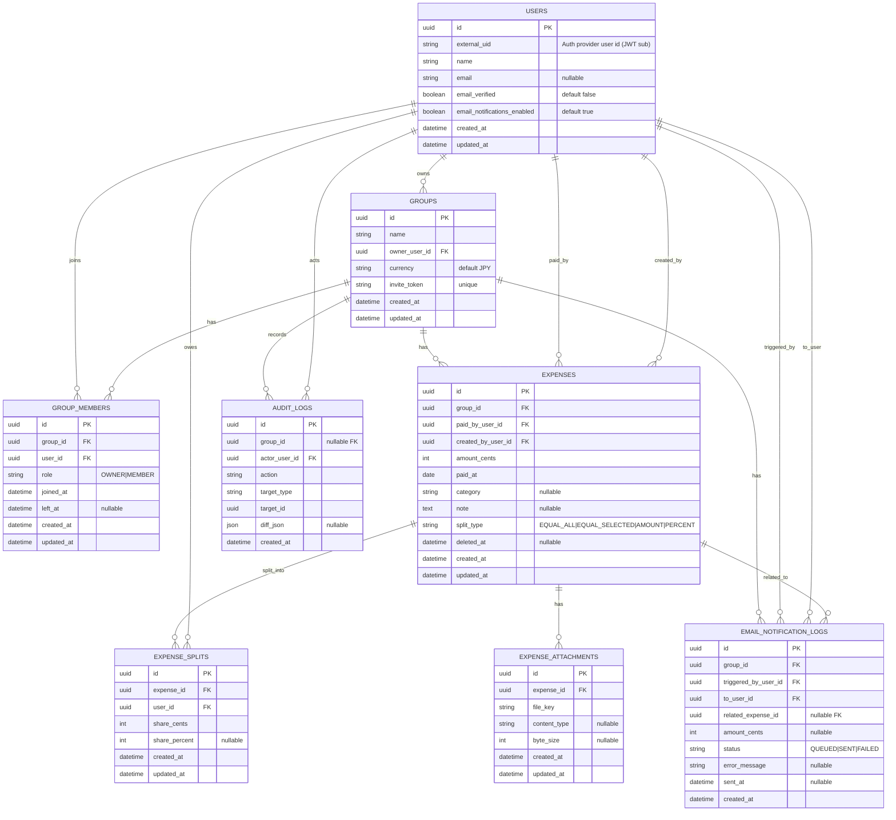

# ER Diagram（Mermaid）- Splitto（説明付き）

このドキュメントは、割り勘・立替精算アプリ **Splitto** のデータモデルを
ER図（Mermaid）とテーブル説明（Markdown）をセットで管理します。

## 共通方針
- DB：PostgreSQL 想定
- 金額：`*_cents`（整数）で保持（JPYでも整数で統一）
- タイムゾーン：DBはUTC、表示はJST
- 途中参加/途中退出：`group_members.left_at` で表現（NULL=在籍中）
- 削除：原則論理削除（`deleted_at`）

---

## Mermaid ER Diagram

## テーブル説明（重要）

### USERS（ユーザー）
**目的**：認証ユーザーのプロフィールと通知設定を保持する。

**主なカラム**
- `external_uid`：認証基盤のユーザー識別子（JWT の `sub` など）
- `name`：表示名
- `email`：メール連絡機能で使用（任意）
- `email_verified`：メール認証済みかどうか
- `email_notifications_enabled`：メール通知の受信可否

**制約・ルール**
- `external_uid` はユニーク
- メール送信は `email` が存在するユーザーのみ可能
- 運用方針により `email_verified = true` のみ送信許可とすることも可能

**インデックス案**
- `users(external_uid)` UNIQUE
- `users(email)` UNIQUE（メールをログインに使う場合）

---

### GROUPS（グループ）
**目的**：旅行・飲み会・同棲など、精算対象となる単位。

**主なカラム**
- `owner_user_id`：グループ作成者（OWNER）
- `invite_token`：招待リンク用トークン
- `currency`：通貨（将来拡張用、MVPでは JPY 固定）

**制約・ルール**
- グループ作成時に OWNER を `group_members` に必ず登録する
- `invite_token` は外部公開されるため推測困難な値を使用

**インデックス案**
- `groups(owner_user_id)`
- `groups(invite_token)` UNIQUE

---

### GROUP_MEMBERS（グループメンバー）
**目的**：グループへの参加状態・ロール管理。途中参加・途中退出に対応。

**主なカラム**
- `role`：`OWNER | MEMBER`
- `joined_at`：参加日時
- `left_at`：退出日時（NULL の場合は在籍中）

**制約・ルール**
- 同一ユーザーが同一グループに在籍中のレコードは 1 件のみ
- 再参加時は新しいレコードを作成する
- OWNER は原則 1 名（必要に応じて複数可）

**インデックス案**
- `group_members(group_id, user_id)`
- `group_members(group_id, left_at)`

---

### EXPENSES（支払い）
**目的**：立替支払いの元データ。清算・集計の基点となる。

**主なカラム**
- `paid_by_user_id`：実際に支払ったユーザー
- `created_by_user_id`：入力したユーザー（代理入力を想定）
- `amount_cents`：支払金額（整数）
- `split_type`：割り方の種類
- `deleted_at`：論理削除用

**制約・ルール**
- `amount_cents > 0`
- 削除は物理削除せず論理削除
- 清算の根拠は `expense_splits` に保存された値を使用する

**インデックス案**
- `expenses(group_id, paid_at)`
- `expenses(group_id, deleted_at)`
- `expenses(paid_by_user_id)`

---

### EXPENSE_SPLITS（支払い割り当て）
**目的**：各ユーザーの負担額を確定保存する。

**主なカラム**
- `share_cents`：ユーザーごとの負担金額
- `share_percent`：割合指定時のみ使用（任意）

**制約・ルール**
- 1 つの支払いに対して、対象メンバー分のレコードを作成
- `SUM(share_cents) = expenses.amount_cents` を必ず保証する
- `share_cents >= 0`

**インデックス案**
- `expense_splits(expense_id)`
- `expense_splits(expense_id, user_id)` UNIQUE

---

### EXPENSE_ATTACHMENTS（添付ファイル）
**目的**：レシート画像などの添付情報を管理。

**主なカラム**
- `file_key`：ストレージ（S3 等）上のキー
- `content_type`：MIME タイプ
- `byte_size`：ファイルサイズ

**制約・ルール**
- ファイル実体はストレージに保存
- DB にはメタ情報のみを保持
- 署名付き URL は都度生成する

**インデックス案**
- `expense_attachments(expense_id)`

---

### AUDIT_LOGS（監査ログ）
**目的**：重要操作の履歴を保持し、トレーサビリティを確保する。

**主なカラム**
- `actor_user_id`：操作したユーザー
- `action`：操作内容（例：`expense.created`）
- `target_type` / `target_id`：操作対象
- `diff_json`：変更差分（任意）

**制約・ルール**
- 支払い・メンバー・設定変更など重要操作は必ず記録する
- 削除操作も必ずログに残す

**インデックス案**
- `audit_logs(group_id, created_at)`
- `audit_logs(actor_user_id, created_at)`
- `audit_logs(target_type, target_id)`

---

### EMAIL_NOTIFICATION_LOGS（メール送信履歴）
**目的**：清算金額連絡メールの送信履歴と状態管理。

**主なカラム**
- `triggered_by_user_id`：送信操作を行ったユーザー
- `to_user_id`：送信先ユーザー
- `amount_cents`：送信した金額
- `status`：`QUEUED | SENT | FAILED`
- `error_message`：失敗理由（任意）
- `related_expense_id`：特定支払いに紐づく場合のみ使用

**制約・ルール**
- メール未登録ユーザーには送信不可
- 送信前に必ず確認画面を表示する
- 失敗時は再送可能とする

**インデックス案**
- `email_notification_logs(group_id, created_at)`
- `email_notification_logs(to_user_id, created_at)`
- `email_notification_logs(status, created_at)`
